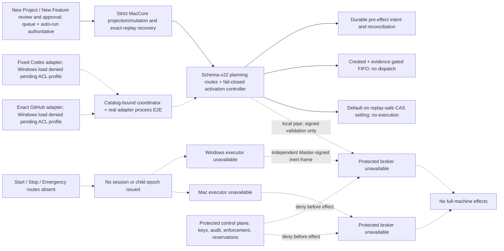
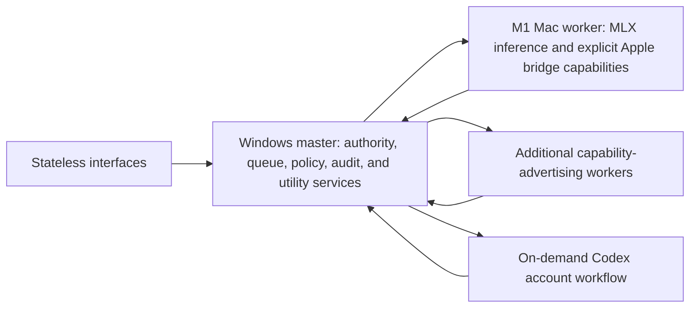

# Architecture Map

## Approved full-machine Assembly Line target

The current Windows master is protocol v5/schema v22. Schema v20 added an
Assembly Line planning lane; schema v21 added durable execution-control and restart-
quarantine state, and schema v22 adds the fail-closed activation controller while
retaining every legacy schema-v19 Feature Conveyor meaning.
The approved replacement target is specified in
`docs/full-machine-assembly-line-design.md`; the reviewed planning/creation source
slice grants no execution authority. Windows keeps its effect adapters unavailable
until capability-separated identities and ACLs are installed and proved. Cutover
still requires that Windows containment, execution
control, signed broker containment on both hosts, native hostile-boundary and recovery
E2E, deployment, and owner-recorded live evidence.

The planning Codex call remains tool-free and planning-only. On Windows its inner
sandbox value is `danger-full-access`; isolation instead comes from the outer
restricted-token AppContainer, exact ACL tree, closed environment, pinned executable,
kill-on-close Job, and a per-call create-only private window station/desktop whose
protected DACL is profile-specific. The master restores its original station before
the suspended child is created and never widens `Winsta0`. The closed Codex child
environment derives `LOCALAPPDATA` and `TEMP`/`TMP` only from separate validated
provider-private writable roots. Non-Windows planning calls keep the inner `read-only` sandbox.
The Windows value is not host or implementation authority.
The Windows effect packages are not below the owner-profile master data path. A
schema-v4 master-private locator binds one exact runtime instance below the canonical
Common Application Data `Assemblywright/planning-runtime` namespace. Exact profile
traverse-only ACEs are merged onto held Common Application Data and shared-ancestor
handles without replacing unrelated ACLs; canonical identities and rights are rechecked
before each effect. The exact fixed profile SID is matched before the profile is
registered idempotently for the current Windows service identity; owner registration
does not substitute for LocalSystem registration. Provider stdin, stdout, and stderr
are all valid inherited handles, with stderr drained concurrently and discarded.
Only the provider's already-DACL-scoped writable roots and descendants receive exact
inheritable Low/No-Write-Up mandatory labels. Immutable provider assets and their root
remain unlabeled. Provisioning can resume an interrupted absent-to-exact label migration,
but rejects every other label shape; mutation is performed through identity-bound
no-delete handles, and the whole profile is revalidated before provider output returns.

The owner-confirmed real-Codex diagnostic is a separate stopped-service proof seam,
not a product effect route. It binds the installed service executable/data-directory
configuration and current schema-v4 runtime, requires the service to remain stopped,
runs exact login status, and conditionally runs one fixed Public structured request
through the existing provider AppContainer/private-desktop/Job path. Its output is a
metadata-only receipt of categories, numeric codes, hashes, and exact profile/runtime
bindings; process text and structured content are discarded. It creates no planning
record, approval, GitHub intent, repository, queue item, or execution authority.

Full-machine target phase: planning/creation containment has bounded native Windows LocalSystem/AppContainer service proof; execution admission is implemented and effects remain unavailable.

The Windows execution-host source now has an authenticated inert IPC foundation.
Master produces two independently Ed25519-signed endpoint-bound frames; Broker verifies
its frame and forwards the byte-exact signed Executor frame. Local-only named pipes
authenticate exact client/server service SIDs, and Broker/Executor return separate
path-free, zero-effect acknowledgements signed by out-of-band service keys that Master
checks against pinned public keys. Append-only hash-chained intent/ack journals preserve
contiguous sequence and nonce state, recover only the exact pending inert request,
replay only the original exact acknowledgement, and quarantine every ambiguous restart
or binding drift. This module is not connected to the product effect dispatcher.

The strict protocol defines the eventual orchestrator, session, child-epoch, control,
termination, and broker-bound records, but types are not runtime availability. The
current master persists planning state and exposes strict production-effect routes,
but Windows cannot load their adapters without the unimplemented containment profile.
The simplified SwiftUI view can review and approve exact frozen specifications and
uses durable exact replay for ambiguous mutations. No current route starts, stops,
pauses, executes, or brokers, and the deployed Windows service cannot invoke the
planning provider or create a GitHub repository.

## Local model selection boundary

- SwiftUI `Models` presents four cards: Mac MLX selectable, local coding fixed,
  Windows RTX not provisioned, and production review fixed.
- `LocalModelSelection.swift` owns canonical path validation, strict intent,
  receipt, terminal-rejection, and projection validation, the mode-0600
  active/pending store with recursive exact-shape/request binding plus
  file-and-directory fsync, and exact select/reconcile behavior. Invalid store
  state blocks supervision. A target-profile session makes the old profile
  ineligible for fallback; pause keeps pending inert, while later unpaused
  monotonic authority revisions can reconcile only the exact committed target.
- `NetworkMTLSBridge.swift` binds ordinary connections to the exact installed
  Keychain profile. A separate reconciliation-only factory operation rechecks
  the frozen old profile/material and admits only its exact derived
  revision-plus-one/requested-model target before the Windows application
  handshake; there is no general transition mode.
- `assemblywright-mac-bridge local-model select|reconcile --confirm` is the
  signed one-shot boundary. The app never loads the bridge private key.
- `GET|POST /v1/distributed/local-model/selection` is mTLS application-session
  only. `assemblywright-master` owns the atomic model-only registry,
  designation, disconnect, and redacted-audit transition.
- `assemblywright-protocol` owns the path-free schema-v1 selection request,
  projection, and receipt. Protocol v5 and master schema v19 are unchanged.

## Distributed development portable foundation

Current implementation:

```mermaid
flowchart LR
  Fixture["Versioned JSON golden fixture"] --> Protocol["Portable assemblywright-protocol crate"]
  Protocol --> Bounds["Strict identifiers, unknown-field rejection, payload ceilings, leases, deadlines, and exact result identity"]
  Protocol --> Master["Portable assemblywright-master SQLite lifecycle kernel"]
  Master --> Process["Headless single-owner master process"]
  Process --> Local["Authenticated loopback development transport and fixture worker"]
  Process --> Identity["Windows enrollment CLI and DPAPI-protected P-256 CA"]
  Identity --> Grants["Ten-minute single-use digest-only grants and verified CSRs"]
  Grants --> Rebind["Schema-v6 two-phase pending capability rebind: inactive cert, exact digests, explicit activation or abort"]
  Rebind --> Replacement["Separate standard Secure Enclave replacement generation; old identity selected until activation"]
  Grants --> Certificates["30-day device certificates, rotation, and revocation"]
  Certificates --> Remote["Optional TLS 1.3 mTLS listener with exact-IP ephemeral server identity"]
  Remote --> Binding["Certificate registry checks, TLS exporter binding, role and epoch enforcement"]
  Master --> Events["Schema-v4 metadata event journal, cancellation state, and server-issued durable cursor"]
  Events --> Helper["Signed Swift bridge keeps Keychain identity and outbound mTLS"]
  Helper --> FixtureIdentity["Exact secondary fixture-only Keychain profile; standard identity unchanged"]
  Helper --> Agent["Directly supervised Mac assemblywright-agent owner-only cursor over mutually pinned local UDS"]
  Process --> Service["Windows SCM host: automatic start, bounded recovery, status, maintenance, uninstall"]
  Service --> Maintenance["Durable fail-closed marker blocks new enqueue and lease admission"]
  Master --> Durable["Registered devices, epochs, queue, attempts, cancellation, expiry, restart reconciliation, exact results"]
  Master --> Conveyor["Default-inert Feature Conveyor repository kernel retained through schema v19"]
  Conveyor --> ConveyorSafety["Immutable approved specs and grants, strict CAS queue, one active lease, atomic redacted audit, and startup quarantine"]
  Conveyor --> Observer["Exact bounded status projection: local owner route plus accepted-session MacBridge-only remote GET"]
  Observer --> Helper
  Observer --> Authoring["Feature 8 typed review-safe authoring plus explicit confirmation; no arbitrary JSON"]
  Conveyor --> OwnerDesignation["Nullable CAS owner-control bridge designation with atomic redacted audit"]
  Conveyor --> GrantControl["Loopback-only contiguous CAS repository-grant revisions and current digest projection"]
  GrantControl --> RepositoryPreflight["Owner-local filesystem-only identity preflight; path-free digest receipt and redacted audit"]
  RepositoryPreflight --> SnapshotClaim["Loopback-only isolated raw-object snapshot plus atomic strict queue-head claim"]
  SnapshotClaim --> CodingDispatch["Explicit loopback-only metadata dispatch bound to exact snapshot, lease, worker, queue, and pause revisions"]
  CodingDispatch --> OwnerResolution["Loopback-only exact cancellation plus evidence-gated abandon-and-advance"]
  CodingDispatch --> SnapshotChunks["Exact leased-attempt bounded snapshot bundle chunks with before-and-after authorization"]
  SnapshotChunks --> Helper
  Helper --> Agent
  Agent --> Materialization["Private Git materialization plus deterministic bounded write/delete operations through held no-follow directory descriptors"]
  Materialization --> Retention["Exact changed-path evidence, sealed workspace, and owner-private bounded recovery record"]
  Retention --> Artifact["Protocol-v5 canonical bounded multi-file artifact constructed in memory"]
  Artifact --> ArtifactAdmission["FIFO mTLS admission during cancellation race; exact binding recheck"]
  ArtifactAdmission --> ArtifactStore["Private bytes outside SQLite; immutable schema-v13 metadata and redacted audit; owner-private fixed shape and guarded crash/concurrent retry"]
  ArtifactStore --> ResultGate["Startup and immediate pre-transaction stable-handle verification; metadata-only result accepted only for exact evidence"]
  ResultGate --> IntegrationPlan["Path-free owner-loopback exact artifact IDs and authority bindings"]
  IntegrationPlan --> Integration["Owner-loopback complete artifact-set integration into an isolated master-owned no-remote repository"]
  Integration --> Candidate["Schema-v14 immutable artifact linkage plus exact frozen Git commit and tree; implementing to validating only"]
  Candidate --> ValidationGate["Schema-v15 owner-loopback strict 13-item evidence contract and immutable digest-only records"]
  ValidationGate --> Reviewing["All required evidence passes: validating to reviewing only"]
  Reviewing --> ReviewGateway["Schema-v16 exact fresh response-only review; immutable decision"]
  ReviewGateway --> Publishing["Strict approval only: reviewing to publishing"]
  ValidationGate --> ValidatorBoundary["Provisioned Windows runner: disposable candidate, deterministic checks, fixed offline commands"]
  OwnerDesignation --> OwnerAction["Exact designated non-fixture MacBridge-only approved-feature POST; queue insertion only"]
  OwnerDesignation --> Authoring
  Authoring --> Helper
  OwnerAction --> Helper
  Helper --> ControlStreamProof["Feature 6 owner-run proof: committed native relay, signed helper and agent, same-stream advancing durable cursor"]
  ControlStreamProof --> ProofReceipt["Path-free private receipt only; no admission or activation authority"]
  ProofReceipt --> OwnerAdmission["Feature 7 Windows owner tool: strict local pair validation, loopback preflight, confirmed digest-only admission"]
  OwnerAdmission --> Conveyor
  Protocol --> Feature["Dormant assemblywright-core distributed-development feature"]
  Protocol --> Windows["Windows distributed format, clippy, protocol, and master-process gate"]
  Process --> Windows
```

Target development-mode architecture:

Feature 6 adds no runtime edge or authority. Its separate owner-run controller
replays only the committed native `--run-relay` harness from exact published
source, verifies stable signed helper/agent identities and durable same-stream
cursor advance after restart, then retains only a path-free transcript-digest-
bound receipt. Windows evidence admission and designated-bridge activation stay
separate authoritative actions; protocol v5 and schema v19 are unchanged.

Feature 7 adds only a Windows-owner edge to the already implemented schema-v19
admission transaction. An owner-token-authenticated loopback GET projects the
current pause/activation state and category digest references needed for CAS.
The PowerShell 5.1 tool validates protected local proof pairs and requires
explicit confirmation before one digest-only POST. Neither endpoint exists on
the enrolled-device router, and the tool cannot activate or execute work.

The repository now owns a portable contract seam, a durable master kernel, and
a headless master executable. The contract seam provides the current protocol
version, typed device/task/step/attempt/lease/cancellation identifiers, bounded
capability advertisements, handshake messages, job and result envelopes, strict
bound-before-decode JSON entry points, nil-identity rejection, and a golden
compatibility fixture. `assemblywright-master` schema version 18 preserves the
schema-v4 distributed-device lifecycle, the schema-v5 Feature Conveyor, and
schema-v6 dedicated pending capability-rebind evidence, then adds the durable
Emergency Pause revision, then adds one nullable compare-and-set owner-control
MacBridge designation. The Feature Conveyor persists the first
default-inert Durable Feature Conveyor repository kernel. Its immutable
owner-approved specification revisions bind canonical manifest and evidence
digests, three independent repository-grant revisions, dependencies, and a
snapshotted review provider/model. Its queue has a 100-item nonterminal ceiling,
one global compare-and-set revision, strict head/dependency ordering, and one
durable active lease. Enqueue, reorder, claim, lifecycle, cancellation,
abandonment, and startup quarantine commit with redacted audit evidence in the
same authoritative transaction. Schema v11 additionally requires every
cancelled or quarantined retained lease to have an immutable resolution-origin
receipt. Its backup-first v10 migration reconstructs a missing receipt only
from one exact append-only audit event and restores the verified v10 backup on
missing, ambiguous, malformed, or non-active-origin evidence. The
Success path releases the lease only with verified
healthy-main evidence; cancellation retains it until explicit safe
abandonment, and restart ambiguity is quarantined without automatic retry.
Schema v12 adds immutable result-artifact bindings and a private filesystem
store; schema v13 adds immutable retained-workspace/expiry bindings for the
bounded general worker. Schema v14 adds an owner-loopback-only complete
artifact-set integration transition, immutable artifact-to-candidate linkage,
and a private frozen no-remote Git candidate repository. It never mutates the
registered source checkout. Schema v15 adds the owner-loopback-only strict
test/evidence-gate request, immutable attempt/command/completion digests, and
the all-required-pass `validating -> reviewing` transition. Its Windows runner
activates only with fixed validated private toolchain/cache provisioning;
otherwise the route rejects before an attempt. Schema v16 adds immutable
independent-review calls, transport outcomes, and strict decisions. Its
owner-loopback-only gateway reconstructs a sensitive-context-screened approved
specification admitted by a strict deny-unknown-fields review-safe DTO, exact
polarity-preserving candidate diff, bounded evidence
digests, and the exact ordered IDs from the required top-level approved-manifest
`acceptance` array, rechecking sensitive content for legacy rows. It launches a configured
canonical provider executable as one cleared-environment bounded process per
call. On Windows it holds a verified no-write/no-delete image handle while a
trusted gate-blocked launcher enters the kill-on-close Job Object before
provider spawn, terminates the complete job tree before pipe joins, and advances
only `reviewing -> publishing` on exact approval. Missing
provider configuration is unavailable by default; publication
authority remains absent. Master-process upgrades from supported legacy schemas
v1-v15 to v16 are
backup-first under the owner lock, verify the versioned backup before migration,
and restore through a fsynced sibling plus atomic replacement when
migration-open fails. Direct file-backed legacy migration through
`MasterKernel::open` fails closed. This persistence slice exposes one
owner-token-authenticated loopback-only
`GET /v1/feature-conveyor/status` observation seam. Its pure-SELECT projection
returns only bounded lifecycle metadata and aggregate lifecycle counts for the
current queue and retained lease. A fixed-enum advisory object bound to queue,
Emergency Pause, and optional feature lifecycle revisions identifies the
queue-head dependency blocker or retained-lease/pause state and
one display-only next owner action. It does not determine claimability or
  authorize that action. The local owner observation route is unchanged; a dedicated
`GET /v1/distributed/feature-conveyor/status` reuses the exact projection only
after an accepted exporter-bound MacBridge session, denies other roles, and
forwards no owner token. The Swift helper validates the exact schema-v9
allowlist and the app displays it only while authenticated. Feature 8 adds a
typed review-safe authoring form that binds that authenticated queue,
designation, and pause snapshot to owner-entered proof/grant/provider/dependency
metadata, inserts the fixed validation gate, and requires explicit confirmation.
It accepts no arbitrary JSON and reaches only the pre-existing one-shot signed
helper action after stopping observation and revalidating the helper. Windows
recomputes the canonical manifest digest and remains the sole queue authority.
The form adds no grant, proof, claim, dispatch, repository, provider,
publication, or activation authority. The current reviewer binding is fixed,
the confirmation displays the frozen bindings, and embedded secret patterns
reject. A possibly lost receipt leaves only an in-memory exact request and a
second confirmed reconciliation action; Windows returns the original receipt
without mutation or another audit only while every original enqueue binding is
unchanged. A separate
owner-token-authenticated loopback grant surface records one strict contiguous
compare-and-set digest-only revision and inspects current grant metadata for a
repository. It is Emergency-Pause-revision bound, blocks active grants while
paused, permits revocation, performs no repository access, and is absent from
the remote router. A separate owner-token-authenticated loopback preflight binds
one strict canonical scope to the exact active registration grant and pause
revision, then performs only bounded point-in-time standard `.git`, symbolic
HEAD, and exact loose-ref identity observation for one single-component branch.
Windows holds the fixed-volume path and identity-chain handles, then reopens and
compares the complete canonical pathname and identities immediately before the
final atomic authorization and audit recheck and retains the fresh handles
through it. It executes no Git process, loads no
repository config or attributes, rejects network/reparse/worktree/submodule
paths, and does not prove clean-tree or content state. It stores and returns no
path, appends only redacted audit,
and emits a path-free digest receipt that grants no snapshot or claimability.
The separate loopback-only snapshot-claim route rechecks that exact scope plus
the strict queue head, dependencies, singleton lease, Emergency Pause, current
three specification grant revisions, and provider/model before and after
filesystem work. It uses raw object-database reads rather than a Git process,
rejects alternates, links/reparse entries and gitlinks, writes independent Git
metadata with no remote, copies only the current commit/tree/blob graph, marks
the base shallow, and excludes parent/deleted history. A fail-fast singleton
reservation serializes resource-capped work and remains task-owned after an
HTTP timeout until the blocking task exits. The finalizer atomically records only snapshot ID/digest/base
commit plus bound revisions. No database transaction spans filesystem work;
failure and request cancellation remove unreferenced state, while startup
cleans abandoned directories and quarantines a finalized active lease.
The schema-v10 owner-token loopback-only coding-dispatch action atomically maps
one exact path-free packet digest onto the existing distributed queued-step
lane. Its immutable row binds the active feature/specification/lifecycle,
feature lease, snapshot ID/digest, queue and Emergency Pause revisions, and one
current non-revoked `InferenceWorker` registration whose singleton capability
is `local.coding.v1`; the distributed event and redacted audit share the same
transaction. The owner route is absent from enrolled-device routing. Lease and
acknowledgement acceptance recheck the binding, while cancellation, Emergency
Pause, lifecycle departure, or restart quarantine blocks later acceptance.
After an exact lease, the default-off snapshot lane reauthorizes every bounded
sequential bundle read and binds each chunk to the full attempt, lease,
cancellation, and snapshot identity. The Mac bridge strictly relays those
chunks over the authenticated local socket. For this exact `InferenceWorker`
profile the Swift supervisor validates the singleton capability and required
relay before connecting, performs authenticated health, and relays without
requesting or emitting the MacBridge-only Feature Conveyor projection.

Protocol v5/schema v19 keeps the historical schema-v10 through schema-v18 lanes
below and adds only deterministic bounded multi-file edits. Rust and Swift share
16 KiB complete-job, 12 KiB context, and 4 KiB replacement limits. The agent
mutates through held owner-private no-follow parent descriptors using exclusive
atomic create, atomic-swap replacement with displaced-inode verification, or
identity-checked `unlinkat`. A successful workspace is sealed; a separate
owner-private recovery record binds its exact job, attempt, post-edit tree digest,
and expiry. Restart reconstructs exact cancellation only from one verified pair
and refuses ambiguous or unresolved new work. No record enters SQLite, audit, or
the remote protocol. The separate schema-v14 owner-local action reopens and
validates the complete terminal accepted artifact set, derives deterministic
order from immutable dispatch metadata, applies it only to a master-owned
candidate repository, and freezes an exact commit/tree. Schema v15 separately
requires the immutable approved manifest's exact ordered 13-command plan and
binds it to the frozen candidate plus lifecycle, lease, snapshot, integration,
queue, pause, and grant revisions. SQLite retains only immutable bounded result
metadata and digests. All 13 passes advance `validating -> reviewing`; failure
stays `validating`, exact retry is idempotent, drift rejects, and startup
quarantines interrupted active validation. The owner route is absent from
enrolled-device mTLS. The runner is connected only with fixed validated Windows
toolchain/cache provisioning; otherwise it returns
`validation_runner_unavailable` before recording an attempt. AppContainer/Job
Object tests prove the process boundary, but not installed-service identity,
signed Mac E2E, a real populated offline cache, or OS-wide egress enforcement.
Schema v16 adds review-decision authority only. Schema v17 adds durable
publication intent/evidence coordination, exact remote-main verification, and
atomic success/queue advancement. Its owner-loopback route is absent from mTLS,
and the credential-owning GitHub adapter remains default-unavailable;
controlled bare-Git proof is not hosted branch-protection proof.
Schema v18 introduced the internal, path-free immutable orchestration checkpoint
ledger and deterministic coordinator. Schema v19 adds the first authoritative
activation writer: Windows loopback admits six strict category-bound proof
references, while only the exact designated exporter-bound MacBridge may bind
their current revisions into the immutable global activation. The same bridge
may pause/resume effect-free orchestration or submit exact cancel/abandon owner
resolution. Emergency Pause remains separate and dominant; the Mac app holds
neither the owner token nor evidence-admission authority and executes actions
only through its independently signed helper.
The Feature 2 restricted-worker proof controller remains outside that authority:
it runs only the committed Mac live harness from exact clean published `main`,
keeps the Windows-local sanitized receipt stream separate from executable
bytes, validates one complete signed-Swift/real-Rust/schema-v19 worker flow and
cleanup, resumes only exact marker-bound preparation/enqueue state after lost
output, then emits only a path-free full-transcript-digest-bound local receipt. Admission and
activation remain later Windows-authoritative owner actions.
Feature 3 likewise remains outside evidence-admission authority. The Windows
master owns a single digest-bound `openai.codex` / `gpt-5.6-sol` adapter
selection and launches it through the schema-v16 response-only Job Object
boundary. The adapter owns only one ephemeral, read-only, tool-disabled Codex
call and receives no repository or credential bytes from the packet. The Mac
proof controller coordinates one fixed approval/rejection semantic pair,
records only definition/transcript/packet/output digests, and never mutates the
queue or admits its receipt.
Replacement-candidate construction remains unavailable under the current
artifact/dispatch contract, so substantive failures stop at owner attention.
Delete first atomically captures the leaf in the held parent and rolls mismatch
back without deleting the replacement. Windows decodes canonical artifact bytes
against the immutable packet and independently matches stored retention/expiry
metadata to the terminal result; Swift remains defense in depth. An already-
referenced schema-v12 row may reopen only the exact canonical protocol-v4 README
artifact with matching stored digest and size. That compatibility path is
startup migration evidence only and cannot admit, revalidate, or accept new work.

Standard and fixture MacBridge observation is unchanged. The native agent
reconstructs and verifies an independent shallow no-remote Git repository in
private per-attempt state while enforcing an aggregate materialized-output byte
budget. Protocol v5 replaces the historical v4 fixed-child `README.md` fixture:
the agent executes only the packet's exact bounded deterministic write/delete
schemas and executes no child, shell, provider, test, network, or credential
operation. It verifies the exact changed-path set and canonical multi-file
artifact, then seals successful state until exact cancellation/resolution or
bounded expiry. Cancellation, pause-driven durable cancellation,
lease/deadline loss, shutdown, and failure dominate completion and cleanup. No
host sandbox or host-egress enforcement is claimed. The schema-v18 master may
integrate and, only with validated private Windows runner provisioning, execute
the fixed validation plan against a verified disposable candidate. Registered-
source mutation and autonomous activation are not implemented. Schema v16
implements the separate owner-loopback independent-review gateway; schema v17
implements durable publication coordination. Feature 4 adds one
default-unavailable fixed Windows GitHub transport that is eligible only after
the pinned Git/GitHub CLI identities, owner-private authentication boundary,
fixed repository, protected `main`, and exact hosted-check mapping validate.
The loopback runtime releases its state lock during external work and accepts
adapter evidence only after cancellation and authority rechecks; enrolled mTLS
still exposes no publication route.
Feature 5 adds no runtime authority. Its fixed Mac proof controller executes the
committed real-agent retained-workspace restart E2E using one digest-pinned
Cargo with caller overrides cleared, then accepts one sanitized Windows receipt
on an isolated descriptor. Windows serializes an explicitly confirmed idle
`AssemblywrightMaster` stopped-state recovery/restoration, offline-rebuilds
exact source with fixed absolute tools, requires an owner/SYSTEM-only single-
link image digest match, proves PID turnover and exact full-database SHA
continuity between stopped freezes, restores the original image, and proves
final bounded protocol-v5/schema-v19 health and empty state. Only a path-free
tool/image/database-digest-bound
receipt pair is retained. Active-effect ambiguity continues to quarantine under
the native master kernel; the controller adds no retry, admission, activation,
streaming, or release authority.
Two additional owner-token loopback-only resolution routes compare-and-set the
exact feature, lifecycle, queue, and Emergency Pause revisions inside the
authoritative transaction. Cancellation cancels bound coding work, retains the
feature lease, and cannot advance. Abandon-and-advance accepts only cancelled
or quarantined state with nonzero safe-reconciliation evidence and, after a
merge, verified healthy-main evidence; it releases the lease and increments the
queue revision. Both routes return fixed path-free receipts, are absent from
enrolled-device mTLS, and add no worker, repository, review, Git, publication,
or activation authority.
Another owner-token-authenticated loopback action designates one exact current,
non-fixture MacBridge. Only that designated device may submit one revision-bound
already-approved specification through the dedicated remote POST; the signed
helper exposes it only as a one-shot `--confirm` command with bounded stdin and
a redacted receipt. This adds queue insertion but no claim, coding worker,
Codex, repository, review-provider invocation, GitHub publication, Mac control
UI, live-device proof, unattended operation, or activation authority.

The existing distributed-device portion of `assemblywright-master` persists explicitly
registered device metadata, active connection epoch and sequence state, queued
steps, immutable leased job envelopes, attempts, cancellation/expiry outcome,
accepted payload digests, the enrollment authority binding, digest-only grants,
device-certificate serial/revocation state, and a metadata-only event journal
with one server-issued stream ID and contiguous sequence. It migrates existing
schema-v1/v2 databases transactionally. It enforces the 256-step admission ceiling, four
global leases, one live lease per device connection, registered capability
context/result limits, exact leased-attempt result identity, and durable
abandon-before-reissue on disconnect or restart. Each authoritative enqueue,
lease, terminal result, cancellation, disconnect, expiry, and restart
reconciliation transition appends its event in the same transaction.
`assemblywright-core` re-exports the
contracts only when the default-off `distributed-development` feature is
selected; it does not yet consume `assemblywright-master`.
The `distributed_protocol_contract_e2e` test serializes the current seam from
Mac capability advertisement through master acceptance, leased job, exact
result acceptance, and wrong-lease rejection. The
`master_lifecycle_e2e` suite adds file-backed fake-worker coverage for durable
success, duplicate and wrong-lease denial, cancellation, expiry,
capability-specific bounds, restart abandonment, late-result rejection, and
safe reissue. `master_process_e2e` additionally starts the actual master and
fixture-worker child processes, proves one-owner database exclusion, bearer
non-disclosure, unauthorized and oversized-body denial, authenticated loopback
health and job completion, and restart reconciliation.
`enrollment_identity_e2e` proves digest-only grants, signed-CSR issuance,
expiry/replay denial, rotation, revocation, schema-v1-to-v6 migration, and the
two-phase same-device capability rebind: pending certificates cannot
authenticate, the replacement-key acknowledgement and CA activation receipt
are independently authenticated, exact lost-output activation is idempotent,
Emergency Pause and stale/mixed/replayed/expired activation fail, immutable
redacted audit rolls back with authority state, and failed or aborted staging
preserves the active registration and certificate. It also
covers real Windows DPAPI round trips and the real CLI stdin boundary.
`event_cursor_e2e` proves bounded paging, durable resume, stream mismatch and
future-cursor rejection, metadata redaction, plus disconnect and requeue events
after restart. The Mac `assemblywright-agent` reuses the hardened local UDS transport,
requires direct-parent supervision and a fresh startup-stdin bearer, and stores
only stream ID, sequence, and update time under a single-owner lock.
Its default-off fixture adapter can hold at most one exact Public
`fixture.reasoning` synthetic-echo attempt in memory. It accepts no model, tool,
file, repository, credential, Codex, or Git input; cancellation suppresses the
result and produces an attempt/lease/epoch-bound acknowledgement. No fixture job
or result is written to the cursor database. `local_relay_e2e` proves those
default-off, bounded execution, cancellation, late-output, bearer, identity,
and cursor boundaries cross-process on macOS. The app does not
export the enrolled identity to the agent: the separately signed helper keeps
the Keychain/mTLS session, directly supervises the exact agent build, and
forwards only authenticated metadata batches over a mutually code-identity-
pinned local socket when the explicit agent paths are configured. Only the
additional exact `ASSEMBLYWRIGHT_MAC_DEVELOPER_FIXTURE_JOBS_ENABLED=true` diagnostic may
lease the registered fixture capability and forward its exact job/result or
cancellation/acknowledgement envelopes.
That opt-in also makes the app launch the helper with the exact
`--identity-profile fixture` argument. The helper selects a separate
device-only Keychain service, Secure Enclave key tag, certificate label, and
staged/installed records; absence of the argument preserves the original
standard profile and command behavior. The fixture profile rejects every
capability other than exact `fixture.reasoning` before staging or connecting.
The standard profile alone can repair the observed stale exact fixture
registration through confirmed rebind prepare/stage/promote commands. It uses
a separate replacement key tag, certificate label, and staged record, requires
the same device/name/role/endpoint/CA and a higher revision with one exact MLX
descriptor, and retains the working installed record until an exact Windows
CA-signed activation receipt is validated. Cancellation checks the installed
generation and cannot delete promoted replacement material; once a certificate
acknowledgement exists it also preserves the entire pre-promotion recovery
record because Windows activation may already be terminal. There is no general destructive
standard-profile remove command.
The standard profile also has a same-device certificate-only recovery path.
Confirmed Windows `rotate-pair` keeps the short-lived raw grant only in the
stopped process and exchanges a public invitation and CSR over stdin. Confirmed
Mac rotation prepare/install reuses the currently selected non-exportable key,
requires the exact installed device, registration, capabilities, endpoint, and
pinned CA, and replaces only the selected certificate after validating the
strict `rotate` receipt. Windows revokes prior serials at issuance; the device
ID, registry revision, capabilities, and owner-control designation do not move.
Before commit, Windows stores the exact public grant-bound receipt in a
protected owner-and-LocalSystem recovery journal. Confirmed recovery re-emits
the same receipt idempotently; only a separate confirmed acknowledgement after
Mac installation and authenticated reconnect removes it. Mac certificate
promotion is forward-resumable across every Keychain mutation boundary.
The standard profile can separately enable an exact singleton
`mlx.reasoning` / `local_inference` / `mlx` lane. Its absolute runtime and model
paths arrive through bounded startup stdin; one Public, no-retention request
runs in memory with a cleared offline environment, prompt-only stdin, bounded
stdout, null stderr, and dedicated process-group reaping. Lease, model, epoch,
attempt, cancellation, and digest identity stay bound. Cancellation, timeout,
disconnect, or emergency pause dominates completion and suppresses late
output. This adds no remote planning, repository, tool, credential, network,
Codex, Git, publication, or unattended authority.
`remote_mtls_e2e` adds a real master process and generated enrolled client over
loopback TLS 1.3. It proves mutual certificate authentication, durable
certificate/device checks, pre-handshake health denial, exporter-bound health
and application-handshake replay denial,
reconnect epoch advance, socket-close reconciliation, and revoked-certificate
denial. Raw remote step enqueue is absent. A persistent authenticated session
proves only a device registered with the exact fixture descriptor may lease its
Windows-locally queued synthetic job, and the result/cancellation path is bound
to that authenticated device and connection epoch. MacBridge metadata retrieval
remains bounded and an enrolled inference-worker cannot retrieve that event
stream.
The default-off live closeout `scripts/mac-windows-bridge-live-e2e.sh
--run-fixture` keeps enqueue, pause, and resume on the authenticated Windows
loopback control plane. The Mac side observes only fixed coordination markers,
redacted status, owner-only sanitized task/step event receipts, and the metadata
cursor. A loopback bearer-authenticated metadata-only event query supports that
binding without adding any remote raw enqueue or data route. Its fixed receipt
requires the agent cursor to consume the exact success and cancellation terminal
sequences, seven seconds without late or duplicate cancellation events, and a
full page drain to a post-deadline durable head. Unexpected same-task kinds,
cursor regressions, and an unbounded unrelated-event tail fail closed.
The proof also requires same-stream resume after a fresh app/helper/agent chain and a fresh
authenticated standard-profile connection with an unchanged stable projection.
Certificate revocation and confirmed local fixture profile removal remain
explicit owner cleanup; the receipt is not inference, repository/Codex/Git,
unattended, or release evidence.
The separate live closeout
`scripts/mac-windows-bridge-live-e2e.sh --run-mlx` uses
`scripts/windows-mlx-live-control.ps1` on the Windows loopback control plane.
Its payload-free receipt binds one real completion and pause-dominated
cancellation to exact event sequences, requires seven seconds without late
output, and proves same-stream helper/agent restart. This is live local LLM
evidence only, with frontier cloud review selective; it is not model-quality,
OS-sandbox, repository/Codex/Git, unattended, signing/notarization, or release
evidence.
`windows_service_lifecycle_e2e` installs a unique real SCM service on an elevated
Windows runner and proves automatic-start/recovery configuration, LocalSystem
loopback hosting, SCM plus runtime health, durable maintenance admission denial,
maintenance preservation through recovery restart, resume, explicit
stop/status/start health transitions, uninstall, and state preservation.
`DeveloperBridgeTests` covers the Mac consumer of the next seam. The shared
protocol adds strict, bounded, secret-free enrollment invitation and CSR reply
documents. A confirmed Windows `enrollment pair` process retains and zeroizes
the raw grant without emitting it. Swift stages a non-exported Secure Enclave
P-256 key plus public binding journal in device-only Keychain items, validates
the issued certificate against that key and pinned CA, and uses
Network.framework for a TLS 1.3-only, client-authenticated, exporter-bound
handshake on one persistent outbound connection.
Live enrollment uses the separately provisioned `AssemblywrightMacBridge` app target;
its embedded CLI receives an Apple application identifier and distinct
Keychain access group, while the SwiftPM executable remains compile-only.
The separate `mac-windows-bridge-live-e2e.sh` harness rejects unentitled or
ad-hoc binaries and uses that production CLI and installed Keychain identity
to prove the real Tailscale path and
authenticated health after owner enrollment; CI uses its `--check` preflight
and retains live execution as external device evidence.

This slice does not make Windows the production runtime authority yet. It adds a foreground
headless executable, process-ownership lock, authenticated loopback development
listener, deterministic fixture-worker process, a separate local enrollment
CLI, an explicit optional remote listener, an explicit Windows SCM lifecycle,
and a default-off cross-device Public synthetic fixture-job diagnostic.
The identity flow creates or
reloads an ECDSA P-256 CA whose PKCS#8 private
key is protected by Windows DPAPI for the current operator identity; SQLite
contains only its public fingerprint. Enrollment grants are server-created,
ten-minute, single-use, role/capability-bound, and persisted only as SHA-256
digests. Issuance accepts the secret-bearing strict JSON request only on stdin,
verifies the client CSR signature, ignores client-requested identity fields, and
issues a 30-day client-auth certificate bound to the durable server-selected
device ID. Rotation revokes the replaced serial and revocation disables the
device plus every active serial. `serve --remote-bind` issues an in-memory-key,
24-hour server-auth certificate for the exact concrete bind IP, restricts rustls
to TLS 1.3, requires a CA-valid enrolled client certificate, rechecks exact
certificate serial/digest/device revocation state on every request, binds the
application handshake to the TLS exporter, and reconciles an accepted epoch on
socket close. The Windows service path retains the same single-owner runtime,
adds automatic start and bounded restart recovery, exposes explicit
install/start/stop/status/maintenance/recover/uninstall commands, and persists a
fail-closed maintenance marker that blocks only new enqueue/lease admission.
LocalSystem is loopback-only; remote mTLS requires the same owner account as the
DPAPI CA and accepts credentials only through bounded stdin. Installation
resolves that account to its exact SID and idempotently grants the native
`SeServiceLogonRight`; failure rolls back the partial service. The Mac bridge
uses an explicitly configured private-overlay IP and provides authenticated
health proof. The Swift app has an owner-configured development lifecycle that
may supervise only the exact separately Apple-signed bridge helper. A strict
owner-private locator holds only the helper path and independently supplied team
identifier; unsafe state blocks startup. The app validates the helper's fixed
identifier, team, CDHash, and distinct Keychain group before supervision and
bounded pairing/status/recovery commands, clears its environment, and renders
helper, enrollment, connection, and Windows projection readiness separately. The helper
may additionally receive only exact agent executable/data paths through bounded
stdin, then pin, launch, and directly supervise that agent while forwarding
authenticated metadata pages into its durable cursor. The enrolled key and mTLS
session stay in the helper. Public ceremony documents remain in memory and the helper
is not bundled. A separate owner-controlled live mode now coordinates a real
Windows service stop/start and requires the production Swift lifecycle to
observe Connected, Master Offline, and a fresh Connected state with a higher
epoch. This adds bounded service-outage recovery evidence, but no discovery,
Tailscale/network-interface outage claim, bundled Rust-agent supervision, or
unattended reliability.
It adds no
general live cross-device reliability claim, supplied-password or
owner-account remote-mTLS E2E, host hardening, upgrade/backup/restore automation,
live inference worker, Codex dispatch, or repository mutation. The distributed
device and Feature Conveyor SQLite data remain
bounded kernels inside the Windows master.

`assemblywright-core` is no longer an assistant runtime. It retains only the hardened
peer-identity Unix-socket transport that the Mac agent consumes, its startup
validation, and read-only release readiness/evidence inspection. The
conversation runtime, model providers and routing, plugin host and wasm
sandbox, SQLite task/audit/memory/approval store, scheduler, trusted
system-wake, workspace roots, and permission engine were removed with the
pivot to Developer Mode.

Future transport and runtime work must preserve
fail-closed policy, planning/action separation, sensitivity and redaction,
explicit cancellation, emergency pause, durable audit evidence, bounded
frames, and result acceptance bound to the exact leased attempt.
The full accepted authority, security, routing, recovery, and rollout target is
kept in `docs/distributed-developer-mode-design.md`, and the Feature Conveyor
target is in `docs/feature-conveyor-design.md`.

## Supervised developer build

The owner-selected developer exception is implemented by
`crates/assemblywright-master/src/developer_main.rs`, with separate Windows SQLite
queue/checkpoint state, local-model file generation, and owner-command validation.
`DeveloperRunnerView.swift` is the native Mac control/observation surface;
`scripts/developer-build.py` builds and reconnects it through the existing SSH
session. This phase leaves production schema, service, and effect admission
unchanged. See `docs/developer-build.md` and `docs/developer-build-testing.md`.
